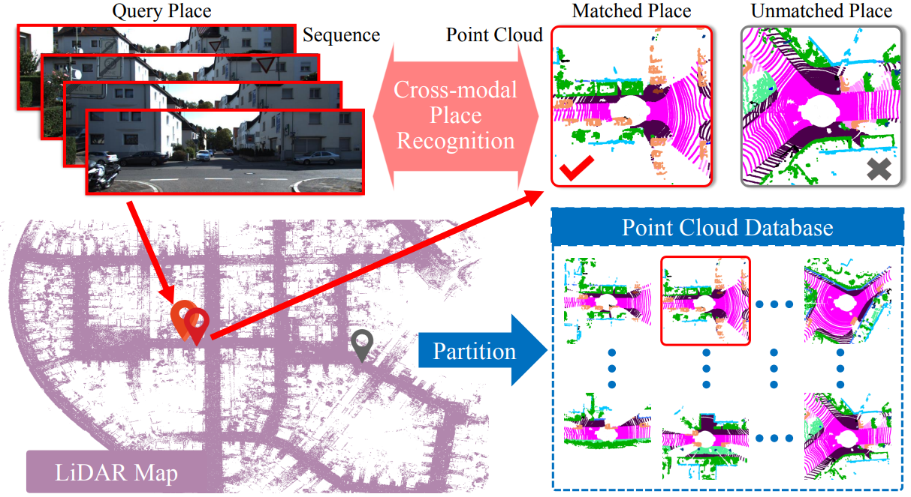
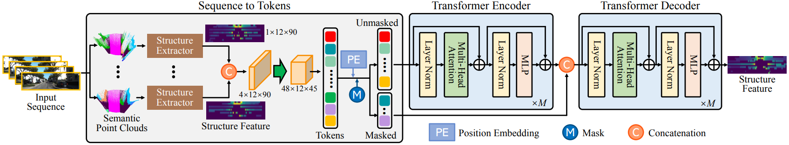

# VSeq2PC
The official implementation of [A Novel Place Recognition Network using Visual Sequences and LiDAR Point Clouds for Autonomous Vehicles](https://labsun.org/pub/ITSC2023_a.pdf).

This work has been published on IEEE ITSC 2023:
[Huaiyuan Xu](https://scholar.google.com.hk/citations?user=kpMGaNIAAAAJ&hl=zh-CN); [Huaping Liu](https://scholar.google.com.hk/citations?user=HXnkIkwAAAAJ&hl=en); Shiyu Meng; [Yuxiang Sun](https://scholar.google.com.hk/citations?user=CuCSzQQAAAAJ&hl=zh-TW)


## Overview
<p align='center'>

</p>
The figure shows the motivation of our cross-modal place recognition method. Given a query place in the form of an image sequence captured by a monocular camera, our method is designed to find the corresponding place from a LiDAR point-cloud database.

## Pipeline
<p align='center'>

</p>


## Get Started

### Installation and Data Preparation

step 1. Please prepare environment as that in [Docker](docker/Dockerfile).
```shell script
$ cd docker
$ docker build -t your_docker_image .
$ docker run -it --shm-size 8G -p 1001:6006 -p 1000:22 --ipc host --name your_docker_container --gpus all -v ~/your_project_direction:/workspace your_docker_image  /bin/bash 
```

step 2. Prepare VSeq2PC repo by
```shell script
$ git clone https://github.com/lab-sun/VSeq2PC.git
$ cd VSeq2PC
```

step 3. Download [data](https://drive.google.com/file/d/1ooq8AeYWcvVTp6nQ3ZSQ1zr1OWBkGiVz/view?usp=sharing) and [checkpoints](https://drive.google.com/file/d/1Vox25WWydZMifudgnfO7bp7PEYgbI-hu/view?usp=sharing). Then arrange the folder as:
```shell script
VSeq2PC/
├── checkpoints
    ├── model
    └── model_mae
├── data
    ├── gt_pairs 
    ├── img_desc
    ├── lidar_desc
    ├── pairs_folder
    └── pose_kitti 
├── docker
└── images
    .
    .
    .
```
## Train models
In train.sh, please modify CUDA_VISIBLE_DEVICES=X, where X points to a specifc graphic card. 
Then, run the following command:
```shell
$ sh train.sh
```

## Evaluate models
In eval.sh, please modify 'CUDA_VISIBLE_DEVICES'.
```shell
# Evaluate place recognition. We take F1 score as the metric.
$ sh eval.sh
# Evaluate loop closure. We take recall@K as the metric.
$ sh eval_recall.sh
```

## Acknowledgement

We thank the fantastic works, [RINet](https://github.com/lilin-hitcrt/RINet) and [Pytorch-Image-Classification](https://github.com/Kedreamix/Pytorch-Image-Classification), for their pioneer code release, which provides codebase for VSeq2PC.


## Citation
If you use VSeq2PC in an academic work, please consider to cite our paper:

    @inproceedings{xu2023novel,
    title={A Novel Place Recognition Network using Visual Sequences and LiDAR Point Clouds for Autonomous Vehicles},
    author={Xu, Huaiyuan and Liu, Huaping and Meng, Shiyu and Sun, Yuxiang},
    booktitle={2023 IEEE 26th International Conference on Intelligent Transportation Systems (ITSC)},
    pages={2862--2867},
    year={2023},
    organization={IEEE}}


 

## Contact

huaiyuan.xu@polyu.edu.hk

Website: https://yuxiangsun.github.io/
